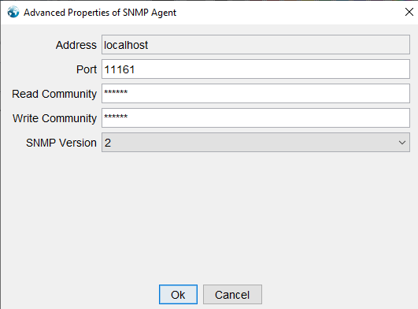
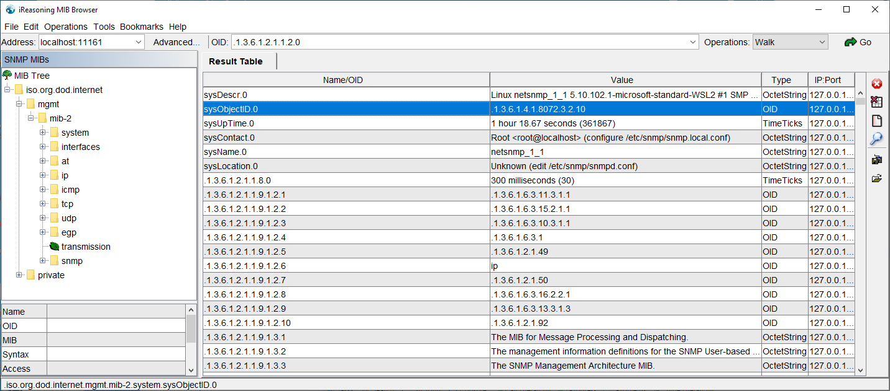
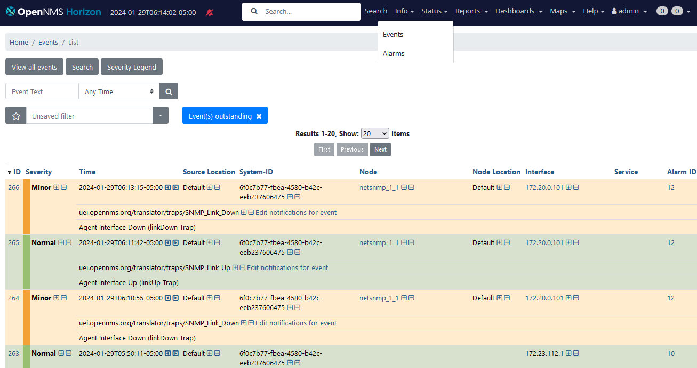

# Exercise 2-2 

[Main Menu](../README.md) | [Session 2](../session2/README.md) | [Exercise-2-2](../session1/Exercise-2-2.md)

# OpenNMS Events

## browsing the mibs using MibBrowser

A very useful free tool for browsing SNMP MIBS and  generating SNMP traps is the Ireasoning Mib Browser which can be installed on Windows or Linux and is downloaded from 

[https://www.ireasoning.com/mibbrowser.shtml](https://www.ireasoning.com/mibbrowser.shtml)

Please install this software on your host system so we can use it to interrogate the SNMP agents in the example containers.

By convention,  SNMP agents use port 161 for responding to SNMP requests and 162 for receiving traps.

However, in order to avoid conflicts with Linux NetSNMP, OpenNMS is usually set up to use a different port to receive traps.
(The OpenNMS core SNMP trap port is set in the file [etc/trapd-configuration.xml](../../main/pristine-opennms-config-files/etc-pristine/trapd-configuration.xml))

In our example [docker-compose.yaml](../session2/minimal-minion-activemq/docker-compose.yaml) file, you will see that each of the netsnmp containers exposes a different port on the host system. 
And the core OpenNMS horizon and the minion1 receive SNMP traps from the host on 10162 and 1162 respectively.

| container | Native SNMP port | Host Exposed SNMP Port |
| --------- | ---------------- | ---------------------- |
| netsnmp_1_1 | 161 | 11161 |
| netsnmp_1_2 | 161 | 11261 |
| netsnmp_2_1 | 161 | 11361 |
| netsnmp_2_2 | 161 | 11461 |
| chubb_camera_01 | 161 | 11561 |
| horizon | 1162 | 10162 |
| minion1 | 1162 | 1162 |

We can try walking the mib of netsnmp_1_1 using the mibbrowser.

Set the address to localhost and open the advanced tab to set the port to `11161` and the community strings to `public`.

When you select operations > walk and then GO, you should see output like this image.

Note the line `Name/OID: sysObjectID.0; Value (OID): .1.3.6.1.4.1.8072.3.2.10`

The sysObjectID will be different for every vendor and device and is assigned by IANA.
You can search a list of susObjectID mappings per vendor here [https://www.iana.org/assignments/enterprise-numbers/](https://www.iana.org/assignments/enterprise-numbers/)

The sysObjectID is the primary means by which OpenNMS knows what sort of device it is and therefore what MIBS are available to collect data from.

`8072` is the registered sysObjectID for NetSNMP. 

`5813` is the registered sysObjectID for The OpenNMS Group, Inc.  (this is often used when OpenNMS forwards traps to other systems)

Try walking the other containers by using a different port.
Note that you will need to use community string `chubb` for chubb_camera_01

## generating an event using MibBrowser

You can use the MibBrowser to generate traps which are sent to OpenNMS.

Select Tools > trap sender

The figure below shows sending a LinkDown trap to horizon on port 1162

With an SNMP V1 Trap you can specify the source IP address and in this case we have specified that the trap is coming from  `172.20.0.101` which corresponds to netsnmp_1_1.

---
**NOTE**
SNMP v1 allows the source IP address to be set as a varbind but  with SNMP v2 traps, you can't specify the source IP as a varbind.
In this case the UDP message must come from the actual device IP address set by the operating system.
See an explanation here https://stackoverflow.com/questions/76741423/pysnmp-impossible-to-change-source-address
---

Send a down tap several times and then look at the OpenNMS event list to see that the traps have arrived as Agent Interface Down (linkDown Trap) events with WARNING severity.

http://localhost:8980/opennms/event/list

On a separate tab, open the OpenNMS alarm list ad you should see a single WARNING Alarm Agent Interface Down (linkDown Trap)  with a count of events.

Now send a LinkUp trap from `172.20.0.101`

You should see a NORMAL severity link up event in the event list

You should also see that the corresponding alarm in the alarm list is now CLEARED and after a few minutes, it will be deleted from the list.

TO BE COMPLETED

Node down node up events and traps
Node down node up alarms

Exercise - happiness alarm
happines alarm
event from trap
event from UI
event from ReST / Rester