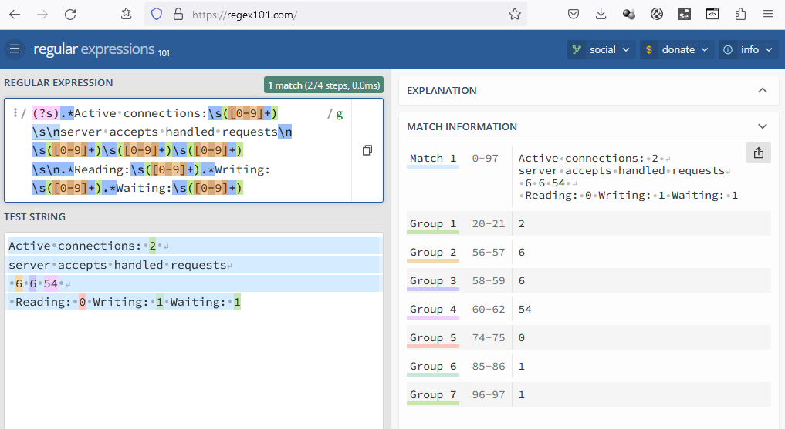

# Session 7 Wrap Up

[Main Menu](../README.md) | [Session 7](../session7/README.md)

## Introduction

This final session will pull together what we have learnt and introduce a few new topics.

This session covers
* HTTPS terminating proxy for OpenNMS using Nginx
* Nginx  monitoring using HttpDataCollector
* Business Service Monitoring
* Brief introduction to Drools
* Brief introduction to Scriptd

[Session 7 Video](https://youtu.be/-0Io3K9Tzjc)

In this example we will introduce grafana and an nginx proxy in a revised netowrk configuration [docker-compose.yaml](../session7/minimal-minion-activemq/docker-compose.yaml)


## Nginx Proxy

OpenNMS can sit behind an https proxy. 

To make this work, we need to add [opennms.properties.d/jetty-https.properties](../session7/minimal-minion-activemq/container-fs/horizon/opt/opennms-overlay/etc/opennms.properties.d/jetty-https.properties)

With the contents
```
opennms.web.base-url = https://%x%c/
```

In the attached configuration we have placed OpenNMS behind an NGINX proxy using self signed certificates

When you start the example you will see a home page at https://localhost/index.html

OpenNMS will be at https://localhost/opennms

Grafana will be at https://localhost/grafana

You will also be able to see NGINX statistics at http://localhost/nginx_status

## Nginx Data Collection

Nginx can produce statistics at a known location.

```
http://localhost/nginx_status
Active connections: 2 
server accepts handled requests
 54 54 261 
Reading: 0 Writing: 1 Waiting: 1 
```

These can be scraped by OpenNMS to create graphs using the following configuration

[docker-compose.yaml](../session7/minimal-minion-activemq/docker-compose.yaml)

[etc/collectd-configuration.xml](../session7/minimal-minion-activemq/container-fs/horizon/opt/opennms-overlay/etc/collectd-configuration.xml)

[etc/http-datacollection-config.xml](../session7/minimal-minion-activemq/container-fs/horizon/opt/opennms-overlay/etc/http-datacollection-config.xml)

[snmp-graph.properties.d/nginx-graph.properties](../session7/minimal-minion-activemq/container-fs/horizon/opt/opennms-overlay/etc/snmp-graph.properties.d/nginx-graph.properties)

A useful tool to help creating regular expressions is https://regex101.com/

THe following diagram illustrates creating the nginx capture groups 




